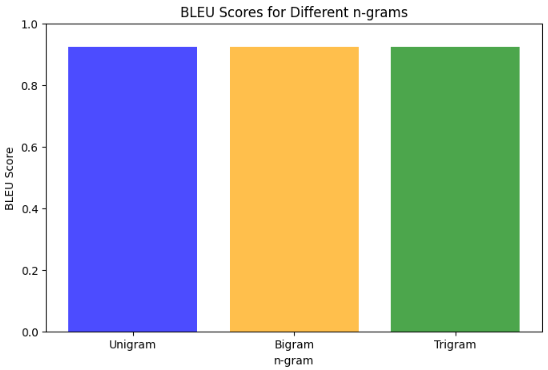
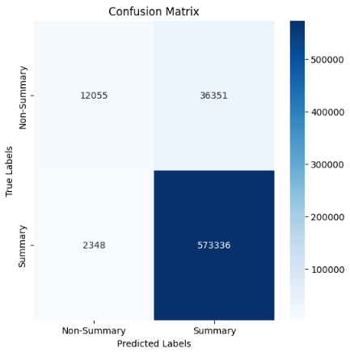

---

# **TextSum: AI-Powered Text Summarization**
An advanced **text summarization project** leveraging deep learning techniques like Bi-LSTM and a **dynamic local attention mechanism** to generate concise, high-quality summaries. Built to tackle **information overload** and extract key insights efficiently from lengthy text.

---

## **Project Overview**
- **Text Summarization**: Reduces long textual content into coherent, concise summaries.
- Two main techniques:
  - **Extractive**: Selects key sentences.
  - **Abstractive**: Generates new, human-like summaries.
- Applications: 
  - Summarizing research papers.
  - Analyzing legal documents.
  - News article summarization.

This project implements **Bi-LSTM** and introduces a **novel local attention mechanism** to dynamically adjust window sizes, improving computational efficiency and accuracy.

---

## **Project Goals**
- Automate text summarization using deep learning.
- Develop **dynamic attention mechanisms** for better focus.
- Achieve high computational efficiency while retaining summary quality.

---

## **Dataset**
The project utilizes the **CNN/DailyMail Dataset** from Kaggle:
- **Content**: News articles paired with human-written highlights.
- **Records**: 
  - Training: 287,113
  - Validation: 13,368
  - Testing: 11,490
- **Example**:  
   **Text**: *"Bishop John Folda... contracted hepatitis A through contaminated food in Italy."*  
   **Summary**: *"Bishop John Folda is taking time off after being diagnosed... Church members may have been exposed."*

---

## **Data Pipeline**
The pipeline includes:
1. **Data Cleaning**: Tokenization, punctuation removal, handling contractions.
2. **Vectorization**: Converting text to numerical embeddings.
3. **Token Embeddings**: Word representations.
4. **Positional Embeddings**: Add word order context.
5. **Dynamic Window Mechanism**: Adjusts sequence focus for attention.

---

## **Model Architecture**
- **Encoder**: 
  - **3-layer Bi-LSTM** with 128 units.
  - Batch normalization and custom sequence handling.
- **Decoder**:
  - Integrates **dynamic local attention**.
  - Dropout for overfitting prevention.
  - Outputs normalized, high-quality summaries.

---

## **Results**
The model achieves outstanding performance:
- **Training Accuracy**: 95.22%
- **Validation Accuracy**: 94.86%
- **Testing Accuracy**: 93.8%
- **F1 Score**: 0.9674  
- **BLEU Scores**:
   - Unigram: **0.9229**
   - Bigram: **0.9229**
   - Trigram: **0.9237**

**BLEU Score Graph**:

**Confusion Matrix Graph**:

---

## **Challenges**
- Handling large datasets and computational constraints.
- Resolving inconsistent tensor shapes during custom layer development.
- Balancing novelty with efficient model design.

---

## **Future Work**
- Extend for **legal document** and **research paper analysis**.
- Integrate **transformer-based architectures** (e.g., BERT, GPT).
- Enable **multilingual support**.
- Optimize for **edge devices** and low-resource environments.

---

## **System Requirements**
- **CPU**: Minimum 16 GB RAM
- **GPU**: 2 × 16GB NVIDIA T4
- Mixed precision with `mixed_float_16` for optimized performance.

---

## **Contributing**
Contributions are welcome! Follow these steps:
1. Fork the repository.
2. Create a new branch (`feature/xyz`).
3. Submit a pull request with a description of your changes.

---

## **Acknowledgments**
This project was part of **CSCI-5922** coursework and reflects collaborative efforts to push the boundaries of text summarization.

---
